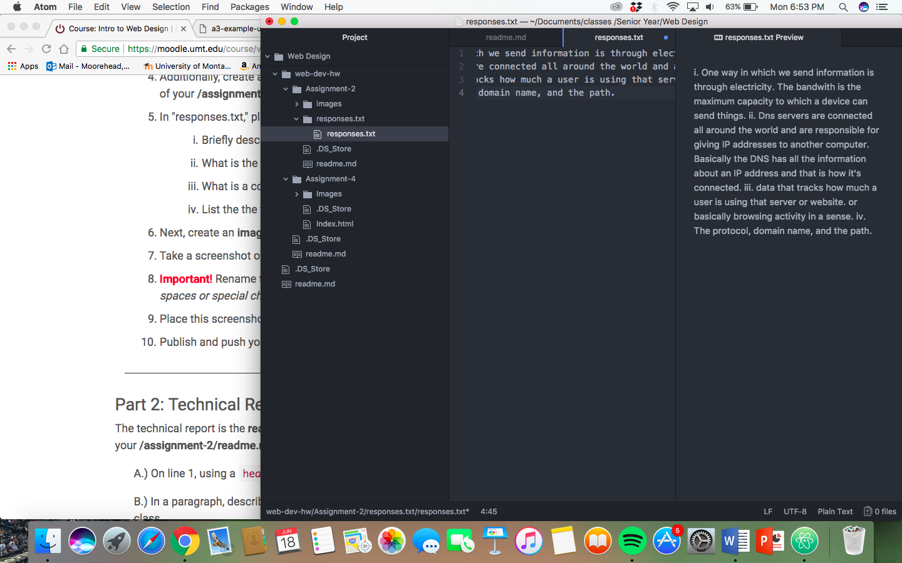

<h1>Assignment 2</h1>

A version control system is what allows a person to make changes to something and to be able to track those changes. This allows the person to keep track and make lists of what changes they made. We use this in this class because it makes sharing much easier and this is an intro class so easy is better.

This was a learning step for me. I honestly have no idea how to do any of this so it took some playing around. The website helped greatly.

[my responses](./responses.txt)

