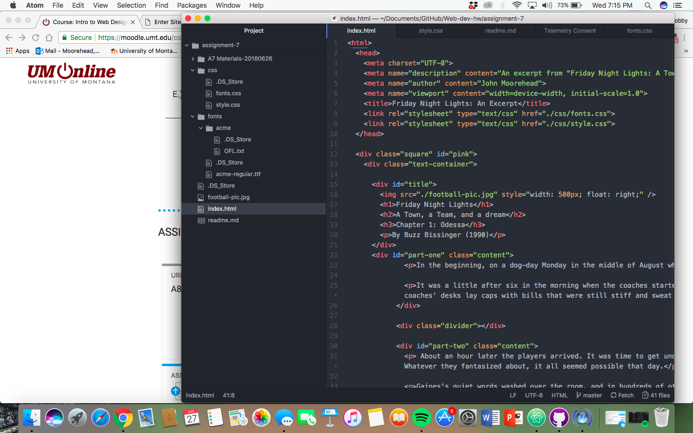

<h1>assignment 7 technical report</h1>

 I chose Paytone+One, Acme, and Georgia for the fonts used in this assignment as well as serif. These fonts were great and ended up styling the website very well. I honestly had no reason for choosing them but I think it worked out.
I chose these becuase when I was reading online on the website it said that the fonts must be a serif or sans serif and that is what I did.

 System fonts are fonts that are already pre-installed onto a system or computer. These are available to us but not always for the web. Web fonts don't have to be on the system you are using or in the computer but are custom fonts hosted on a website.
Web safe fonts are those that are typically preloaded as system fonts but are fonts that work on the web as well.

Fallback fonts are important because if for whatever reason the font you chose fails, then the backup font goes into effect, so it is vrtually a backup plan that does it automatically if their font fails.

This assignment was a difficult one for a few reasons. Getting the fonts to change was a process because for a while they weren't changing on the website until I realized that I wasn't using web fonts so the fonts I was using were affective on my website. The other confusing part was the first letter getting chnaged to a big letter. I tried very hard to just change a few letter fronts to a big letter with different font but for whatever reason whenever I tried to change it I couldn't get the first letter to be nromal but I ended up leaving it because it looks cool.

