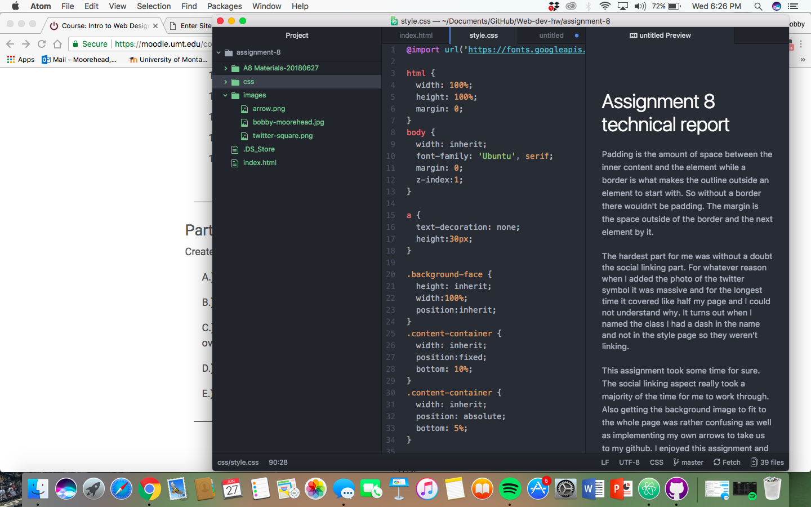

<h1> Assignment 8 technical report</h1>

 Padding is the amount of space between the inner content and the element while a border is what makes the outline outside an element to start with. So without a border there wouldn't be padding. The margin is the space outside of the border and the next element by it.

The hardest part for me was without a doubt the social linking part. For whatever reason when I added the photo of the twitter symbol it was massive and for the longest time it covered like half my page and I could not understand why. It turns out when I named the class I had a dash in the name and not in the style page so they weren't linking.

 This assignment took some time for sure. The social linking aspect really took a majority of the time for me to work through. Also getting the background image to fit to the whole page was rather confusing as well as implementing my own arrows to take us to my github. I enjoyed this assignment and am pleased with my website overall and the look.

