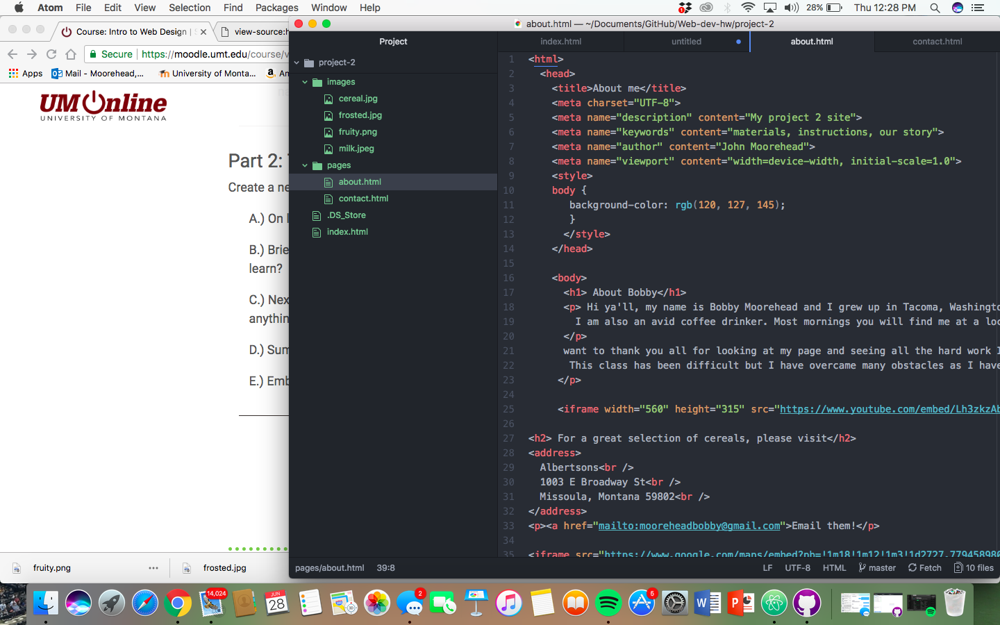

<h1> project 2 technical report</h1>

 Well considering I did this project as the last thing in this class I was fairly familiar with most of the things but some took some serious refreshing since I hadn't done them in a while.
For example, getting the table figured out was a bit time consuming as well as the buttons for the questionaire. I found it interesting getting the sites to link to each other. It took some playing around with it for a while to get it done.

Well in hindsight, I thought it was really cool to learn to play around with the fonts and styles of the fonts making them different colors among other things. Also placing images in weird ways along the page makes it cool.

 This project was a lot of review for me because it was the last thing that I did in this class. I enjoyed making up something funny like pouring the perfect bowl of cereal. It was enjoyable. I also struggled like I said figuring out some of the old things we had done like the buttons and such. I also could not figure out the placeholder again so that was a bummer.

